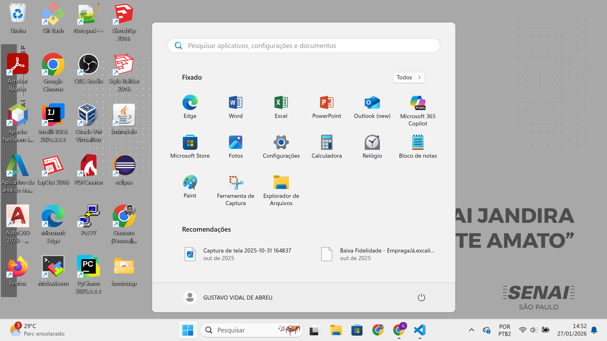
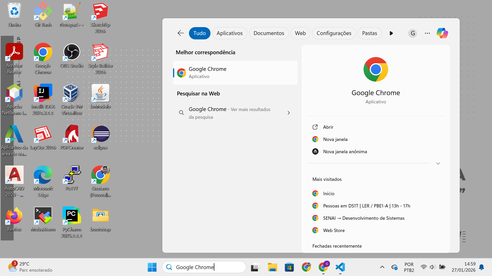
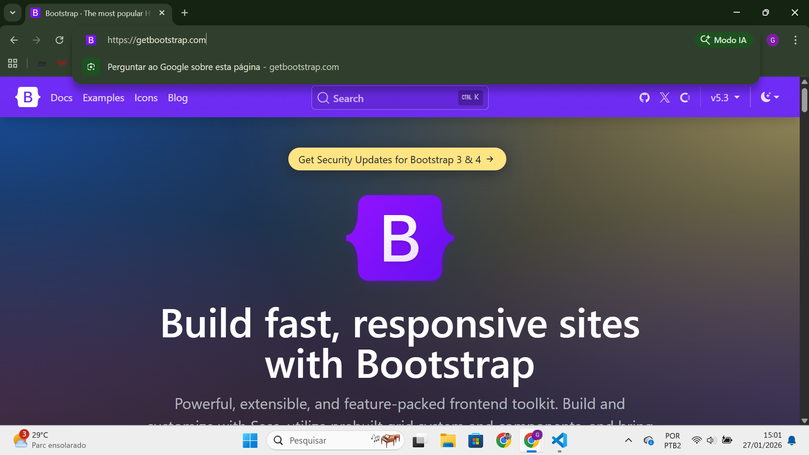
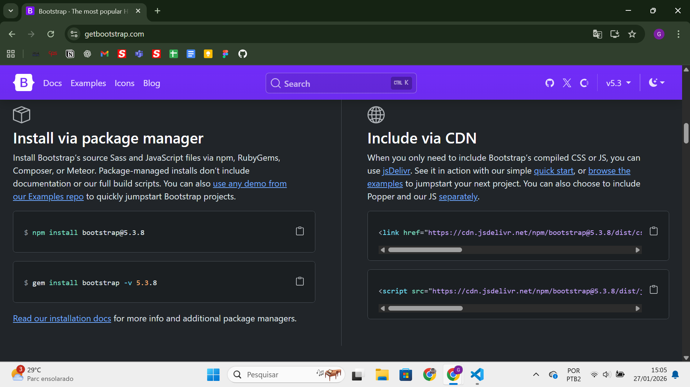
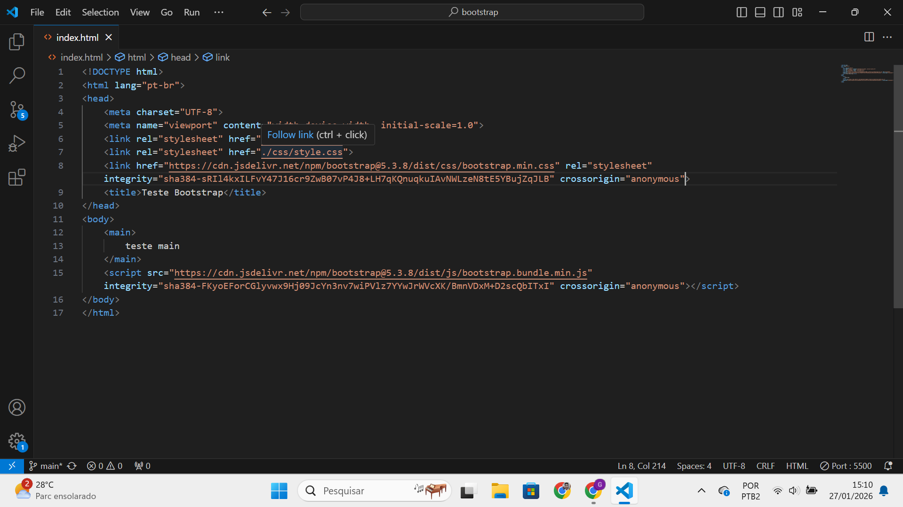
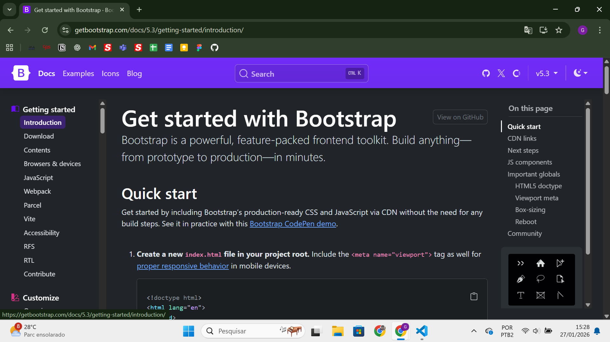

# Framework Bootstrap

## Como instalar o Bootstrap (CDN)
1. Primeiramente, clique na tecla **Windows** ou no botão do Windows na tela

2. Pesquise por **Google Chrome** e abra o navegador

3. Abra o site **https://getbootstrap.com**

4. Desça e procure até encontrar o tópico **#Include via CDN**

5. Copie os 2 links e cole no seu **HTML**

6. Para estudo, entre no site da **documentação do Bootstrap** clicando na aba **Docs** no mesmo site dos links, e codifique seu site de acordo com as variáveis possíveis do framework

